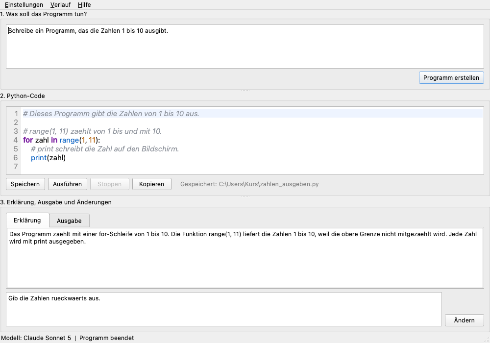

# Jiimbos Power App

Beschreibe in normaler Sprache, welches Python-Programm du brauchst. Die App
lässt es von Claude schreiben, zeigt dir den Code, speichert ihn als
`.py`-Datei und führt ihn auf Wunsch aus.

Gedacht ist sie für Leute, die Python gerade erst lernen: alle Kommentare im
erzeugten Code und alle Erklärungen sind auf Deutsch.



## Herunterladen

Die fertige `JiimbosPowerApp.exe` liegt unter
**[Releases](https://github.com/Zenovs/python-jimbo/releases/latest)**.
Eine Installation ist nicht nötig – Datei herunterladen, doppelklicken, fertig.
Python muss dafür nicht installiert sein.

> Beim ersten Start meldet sich vielleicht der SmartScreen-Filter von Windows,
> weil die Datei nicht signiert ist. Über «Weitere Informationen» →
> «Trotzdem ausführen» kommst du weiter.

## API-Key holen

Die App spricht mit der Anthropic-API und braucht dafür einen eigenen Zugang.

1. Auf [console.anthropic.com](https://console.anthropic.com) ein Konto anlegen.
2. Unter **Billing** ein Guthaben aufladen (der kleinste Betrag reicht für sehr
   viele Anfragen).
3. Unter [**API keys**](https://console.anthropic.com/settings/keys) einen neuen
   Key erzeugen und kopieren – er beginnt mit `sk-ant-`.
4. In der App im Menü **Einstellungen** einfügen und speichern. Beim allerersten
   Start fragt die App von sich aus danach.

Der Key wird in der **Anmeldeinformationsverwaltung von Windows** abgelegt
(unter macOS im Schlüsselbund), nicht in einer Datei. Er steht in keinem Log
und in keiner Fehlermeldung.

## Was eine Anfrage kostet

Jeder Klick auf «Programm erstellen» oder «Ändern» ist eine bezahlte Anfrage an
Anthropic. Für eine übliche Einsteigeraufgabe fallen mit dem Standardmodell
**etwa 1 bis 2 Rappen (rund 0,01–0,02 US-Dollar)** an.

| Modell | Eingabe (pro 1 Mio. Token) | Ausgabe (pro 1 Mio. Token) |
|---|---|---|
| Claude Sonnet 5 (Standard) | 2 $ | 10 $ |
| Claude Opus 5 | 5 $ | 25 $ |
| Claude Haiku 4.5 | 1 $ | 5 $ |

Massgebend ist immer die [Preisliste von
Anthropic](https://www.anthropic.com/pricing). Dein tatsächlicher Verbrauch
steht in der Console unter **Usage**. Das Modell lässt sich in den
Einstellungen umstellen.

## Achtung: der Code läuft ungeschützt auf deinem Rechner

Wenn du auf **Ausführen** klickst, startet das erzeugte Programm mit deinem
lokal installierten Python und **mit deinen vollen Rechten**. Es gibt
absichtlich **keine Sandbox**: Das Programm darf Dateien lesen, schreiben und
löschen, so wie jedes andere Programm, das du selbst startest.

**Lies den Code, bevor du ihn ausführst.** Die App weist vor dem ersten Start
einmal darauf hin.

Zum Ausführen braucht es ein installiertes Python. Die App sucht zuerst nach
`py -3`, dann nach `python`. Fehlt beides, verweist sie auf
[python.org/downloads](https://www.python.org/downloads/) – setz bei der
Installation den Haken bei «Add python.exe to PATH».

## Bedienung

1. **Oben** beschreiben, was das Programm tun soll, und auf «Programm erstellen»
   klicken. Der Code baut sich sichtbar auf, während er geschrieben wird.
2. **In der Mitte** steht der Code mit Zeilennummern und Farben. Du kannst ihn
   von Hand ändern. Die Knöpfe: **Speichern** (als `.py`), **Ausführen**,
   **Stoppen**, **Kopieren**.
3. **Unten** steht im Reiter *Erklärung*, was das Programm macht, und im Reiter
   *Ausgabe*, was es beim Laufen ausgibt. Braucht das Programm eine Eingabe
   (`input()`), tippst du sie ins Feld darunter.
4. Passt etwas nicht, beschreibst du im Feld ganz unten die Änderung und
   klickst auf **Ändern**.

Im Menü **Verlauf** stehen die letzten 20 Aufgaben und lassen sich mit einem
Klick wieder einsetzen. Bricht ein Programm ab, weil ein Zusatzmodul fehlt,
bietet die App an, es mit `pip install` nachzuinstallieren.

## Selbst bauen

Gebraucht wird Python 3.12 bis 3.14.

```powershell
git clone https://github.com/Zenovs/python-jimbo.git
cd python-jimbo
powershell -ExecutionPolicy Bypass -File build.ps1
```

`build.ps1` legt die virtuelle Umgebung an, installiert die Abhängigkeiten,
lässt die Tests laufen und baut anschliessend `dist\JiimbosPowerApp.exe`.

Aus dem Quellcode starten, ohne zu bauen:

```powershell
py -3 -m venv .venv
.venv\Scripts\pip install -r requirements.txt
.venv\Scripts\python -m jimbo
```

Unter macOS und Linux geht dasselbe mit `python3` und `.venv/bin/…`. Der Code
ist plattformneutral; fertig gebaut wird bisher aber nur für Windows.

Tests:

```powershell
.venv\Scripts\pip install -r requirements-dev.txt
.venv\Scripts\python -m pytest
```

Ein Tag `v…` löst über GitHub Actions automatisch einen Build aus und hängt die
`.exe` an das Release:

```bash
git tag v1.0.0 && git push origin v1.0.0
```

## Aufbau des Projekts

```
src/jimbo/
  __main__.py   Startpunkt
  app.py        Fenster, Dialoge, Bedienung
  api.py        Anfrage an die Anthropic-API, Prompt, Auswertung der Antwort
  editor.py     Code-Feld mit Zeilennummern und Einfärbung
  runner.py     erzeugten Code ausführen, fehlende Module erkennen
  settings.py   API-Key (keyring), Modell, Pfade, Verlauf
assets/         Symbol und Bildschirmfoto
tools/          erzeugt aus dem ASCII-Zeichen das Symbol
tests/          Tests (das SDK wird dabei durch eine Attrappe ersetzt)
launcher.py     Startskript für PyInstaller
build.ps1       baut die .exe
```

Das Symbol ist ein ASCII-Zeichen mit 3D-Wirkung, erzeugt von
`tools/make_icon.py`. Änderst du dort das Raster `GLYPH`, ändern sich Symbol
und Logo gemeinsam.

## Was die App nicht macht

- Kein Chat: jede Anfrage steht für sich, es gibt keinen Gesprächsverlauf mit
  der KI.
- Keine Sandbox für den ausgeführten Code (siehe oben).
- Keine Telemetrie. Ausser den Anfragen an die Anthropic-API verlässt nichts
  deinen Rechner.
- Nur Deutsch, und fertig gebaut nur für Windows.

## Lizenz

MIT – siehe [LICENSE](LICENSE).
